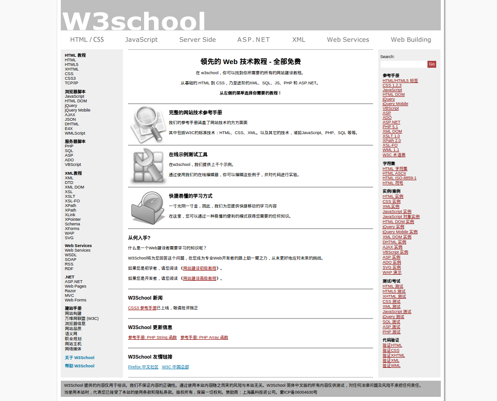

# [w3school](http://www.w3school.com.cn)  home 页面制作

## 制作效果

## 制作步骤

- 使用 `*` 清除所有标签的 padding margin border
- `body` 标签

    - 通过 `background` 属性设置一张背景图以及背景颜色，`背景图片在颜色之上`
    
- `div#wrapper` 

    - 通过 `设置宽度` 和 `margin: 0 auto` 实现水平居中效果

- `div#wrapper div#header_index`

    - 简单的设置了一张已经做好了的背景图片
    
- `div#wrapper div#navfirst`

    - 在 `ul` 标签上设置了一张背景图片
    - 对 `li` 标签设置 `absolute` 属性实现水平排列，并根据图片设置了高度和宽度
    - 在 `li a:hover` 设置了 `background` 背景图片，并通过固定的位置移动实现了红色下划线的效果

- `div#wrapper div#navsecond`

    - 这部分通过 `h2` 和 `ul` 标签实现，设置了一定的 `margin` 进行内容的隔离
    
- `div#wrapper div#maincontent`

    - 通过 `border` 属性将各个部分分离开来，并通过设置 `margin` 进行左右隔离，通过 `padding` 进行上下隔离
    - `h2` 和 `p` 通过一定的 `margin` 设置进行隔离
    - 其中比较有意思的就是中的三个图片的设置，使用了 `float: left` 之后:
        
        - 脱离了正常的文档流，使得父元素 `高度塌陷`，并且由于浮动元素是 `向顶，向右或向左` 对齐的，所以三张图片在主队角线排列，通过为父元素设置 `min-height` 之后，浮动元素 `不会超过其之前的非浮动元素底端`，进而避免的错误的效果
        - 这里其实还暗藏说明了浮动元素 `不会超过父元素的内边界` 的效果
    
- `div#wrapper div#sidebar`

    - 这个部分和 `navfirst` 部分差不多，唯一一点我学到的东西就是可以通过设置 `font-size` 来控制表单输入的字体大小
    
- 上述上个元素是通过设置 `float: left` 和　`width` 进行和并在一起的，说明了浮动元素的如下性质

    - 浮动元素不会超过其之上的非浮动元素的底端
    - 浮动元素不会超过其包含块的内边界
    
- `div#wrapper div#footer`

    - 通过设置 `clear: both` 消除浮动对其产生的影响
